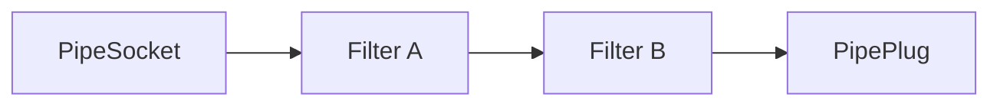

# 📐 Pippin

Pippin is a reference architecture for the pattern "Pipes and Filters".
Pips is a short version of the name "Pippin" (Perigrin Tuk) and sounds
a bit like pipes. That's why this project is called "Pippin".

🛠️ This project targets netstandard2.0 so it can basically be used anywhere you want. 
I've not yet run any performance tests.

## 💻 Usage

Pippin provides several abstract classes which allow to establish pipes with chained filters.
You just need to inherit from these abstract classes and establishing a filter pipe, beginning at a 
`PipeSocket`, followed by a `Filter` and terminated by a `PipePlug`. 
The diagram below shows an exemplary setup.

Pippin also provides special filters, sockets and plugs, which allow queueing and processing on background threads.
These classes are `QueuePipeSocket`, `QueueFilter` and `QueuePipePlug`.

## ⌨️ Developing

To develop and work with Pippin you just need to clone this Repo somewhere on your PC and then open the Solution or the complete Source-Folder (under `src`) with your favorite IDE. No additional tools required.

Before you can start, you should restore all NuGet-Packages using `dotnet restore` if that's not done for you by your IDE.